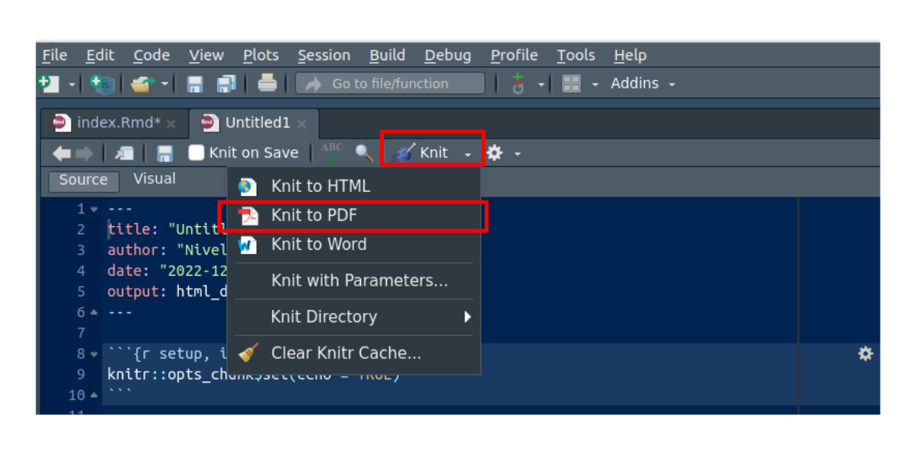

<br/><br/>


```{r, echo=FALSE, out.width="100%", fig.align = "center"}

```
<small>Tomada de : pixabay.com</small>

<br/><br/>

El propósito principal de la actividad es brindar la oportunidad de familiarizarse con el programa estadístico R en la elaboración de informes estadísticos. Siguiendo  los pasos proporcionadas, podrás llevar a cabo un análisis de la población afectada por Covid-19 en la región de tu elección.

<br/>

En este proceso, se espera que apliques las funciones indicadas  para obtención de la data, su limpieza y la generación de indicadores estadístocos y gráficos que permitan 
analizar datos relacionados con la propagación del Covid-19 en la región que te interese. 
 
<br/>

Una vez completado el análisis, se te solicitará que prepares un informe que resuma tus hallazgos de manera clara y concisa. Para ello, deberás crear un archivo en formato PDF, en la plataforma Brightspace. 


<br/><br/>

```{r setup, include=FALSE}
knitr::opts_chunk$set(echo = TRUE)
```


## <span style="color:#034a94"> **Paso 1 :**</span>
### <span style="color:#034a94"> **Instala los siguientes paquetes y actívalos en tu computador o equipo de trabajo**</span>


```{r, eval=FALSE}
install.packages("tidyverse") #  instalación de paquete para manejo de datos
install.packages("RSocrata", dependencies = TRUE)   # instalación de paquete RSocrata lee datos de manera remota
install.packages("devtools")  # instala paquete para descargar paquetes desde github
devtools::install_github("dcomtois/summarytools") # descarga paquete summarytools desde repositorio github
library(tidyverse)   # libreria util en el manejo de datos
library(RSocrata)    # llamado de libreria RSocratas
```

<br/><br/>

## <span style="color:#034a94"> **Paso 2 :**</span>
### <span style="color:#034a94"> **Descarga la data **</span>

```{r, eval=FALSE}
token <- "zxMsD6eXc0zlEMryRGW87Hwrz"  # token
Colombia <- read.socrata("https://www.datos.gov.co/resource/gt2j-8ykr.json", app_token = token) # lectura de manera remota 

```

<br/><br/>

## <span style="color:#034a94"> **Paso 3 :**</span>
### <span style="color:#034a94"> **Arregla la data**</span>

```{r, eval=FALSE}
table(Colombia$estado)
table(Colombia$sexo)
table(Colombia$ubicacion)


Colombia$edad=as.integer(Colombia$edad)  # convertir en entero la variable edad
Colombia$sexo=str_to_lower(Colombia$sexo) # pasar a minúsculas todos valores de la variable sexo
Colombia$estado=str_to_lower(Colombia$estado) # pasar a minúsculas todos lo valores de la variable estado
Colombia$estado[Colombia$estado=="n/a"]=NA   # cambiar el valor  n/a por NA - valores faltantes
Colombia$recuperado=str_to_lower(Colombia$recuperado) # pasar a minúsculas todos los valores de la variable recuperado
Colombia$recuperado[Colombia$recuperado=="n/a"]=NA 
Colombia$ubicacion=str_to_lower(Colombia$ubicacion) # pasar a minúsculas todos los valores de la variable ubicación
Colombia$ubicacion[Colombia$ubicacion=="n/a"]=NA 
```

<br/><br/>

## <span style="color:#034a94"> **Paso 4 :**</span>
### <span style="color:#034a94"> **Selecciona una data de tu interés**</span>

```{r, eval=FALSE}
Colombia22=subset(Colombia, Colombia$fecha_reporte_web>="2022-01-01") # data del 2022
Colombia21=subset(Colombia, Colombia$fecha_reporte_web>="2021-01-01" & Colombia$fecha_reporte_web<"2022-01-01") # data de 2021
Colombia20=subset(Colombia, Colombia$fecha_reporte_web>="2020-01-01" & Colombia$fecha_reporte_web<"2021-01-01") # data de 2020
Colombia22_11=subset(Colombia, Colombia$fecha_reporte_web>="2022-11-01") # data desde  nov-01-2022 
Valle22_11=subset(Colombia22_11, departamento=="76") # data del Valle del Cauca desde nov-01-2022
Cali22_11= subset(Colombia22_11, ciudad_municipio_nom=="CALI") # data de Cali desde nov-01-2022

```

<br/><br/>

## <span style="color:#034a94"> **Paso 5 :**</span>
### <span style="color:#034a94"> **Construye las tablas**</span>

```{r, eval=FALSE}
table(Colombia22$estado)
table(Colombia21$estado)
table(Colombia20$estado)
table(Valle22_11$estado)
table(Cali22_11$estado, Cali22_11$sexo)

summarytools::freq(Colombia22$estado, cumul = F)
summarytools::freq(Colombia21$estado, cumul = F)
summarytools::freq(Colombia20$estado, cumul = F)
```

<br/><br/>

## <span style="color:#034a94"> **Paso 6 :**</span>
### <span style="color:#034a94"> **Construye los indicadores estadísticos**</span>
```{r, eval=FALSE}
mean(Colombia22_11$edad, na.rm = TRUE) # media
median(Colombia22_11$edad)             # mediana
var(Colombia22_11$edad)                # varianza
sd(Colombia22_11$edad)                 # desviación estandar
min(Colombia22_11$edad)                # mínimo
max(Colombia22_11$edad)                # máximo

summarytools::descr(Colombia22_11$edad)
```

<br/><br/>

## <span style="color:#034a94"> **Paso 7 :**</span>
### <span style="color:#034a94"> **Construye los gráficos**</span>

```{r, eval=FALSE}
t1=table(Colombia$sexo)
pie(t1)

t2=table(Colombia$sexo,Colombia$ubicacion)
barplot(t2, las=str_to_lower(Colombia$estado)1)

hist(Colombia22_11$edad, las=1, xlab = "edad (años)", ylab = "frecuencia", 
main = "Edad de personas contagiadas Covid19 Colombia- Nov 2022" )

boxplot(Colombia$edad, horizontal = TRUE,
main = "Edad de personas contagiadas Covid19 Colombia")


```

<br/><br/>

## <span style="color:#034a94"> **Paso 8 :**</span>
### <span style="color:#034a94"> **Escribe el análisis de los datos**</span>


Finalmente realiza un análisis de los resultados obtenidos.
Recuerde que para hacerlo debe tener en cuenta los indicadores de posición, centro, dispersión y forma. Además ayuda a reforzar el análisis una representacón gráfica.


<br/><br/>


<div class="content-box-gray">
### **Nota**

Recuerde que para :

<br/>

* **Iniciar la actividad debe abrir un nuevo archivo .Rmd**

    * *File / New File / R Markdown...* 

<br/><br/>

* **Para procesar el documento y convertirlo en pdf**

```{r, echo=FALSE, out.width="70%", fig.align = "center"}

```


<br/><br/>


* **Para descargar una base de datos abiertos**

<br/>

<center>
<iframe width="560" height="315" src="https://www.youtube.com/embed/lRftK2mL3Sw" title="YouTube video player" frameborder="0" allow="accelerometer; autoplay; clipboard-write; encrypted-media; gyroscope; picture-in-picture" allowfullscreen></iframe>
</center>


</div>

<br/><br/>

### <span style="color:#034a94"> **Funciones R utlizadas**</span>

<br/>

* **apply** : Devuelve un vector, matriz  o lista de valores obtenidos aplicando una función a los márgenes de una matriz. Ej. `x =data.frame(x1= 1:20, x2=21:40)` ; `apply(x,1,mean)` ; `apply(x,2,mean)` .

<br/>


* **as.numeric** : Se utiliza para convertir un objeto en un tipo de dato numérico. Ej.: `as.numeric(c("1.2", "2.5", "3.9"))`. Tambien puede ser utilizada para la construcción de vector de ceros y unos. Coloca uno cuando se cumple una condición y ceros cuando no se cumple. Ej.: `x= 1:20 as.numeric(x > 10)`.

<br/>

* **boxplot** : Se utiliza para crear gráficos de diagrama de caja. Ej.: `boxplot(x)` .

<br/>

* **cat**: Se utiliza para imprimir texto en la consola o en un archivo de salida. Ej.: `cat("Media de la edad", mean(x))`.

<br/>

* **density** : Se utiliza para estimar y trazar la densidad de probabilidad de un conjunto de datos. La densidad de probabilidad es una estimación suave de la distribución de probabilidad subyacente de un conjunto de datos, que puede ayudarte a visualizar la forma y la tendencia de la distribución. Ej.: `plot(density(x))`.

<br/>

* **descr** : Función del paquete summarytools en R es una herramienta útil para generar descripciones estadísticas resumidas de un conjunto de datos. Ej.: `summarytools::descr(x)`.


<br/>

* **freq** : se utiliza para generar tablas de frecuencia para variables categóricas en un conjunto de datos. Ej.: `summarytools::freq(x)` .

<br/>

* **hist** Se utiliza para crear histogramas, que son gráficos que representan la distribución de una variable numérica segmentada por intervalos. Ej.: `hist(x)` .

<br/>

* **install.packages** : En R se utiliza para instalar paquetes o bibliotecas (packages) adicionales en tu entorno de R. Los paquetes son conjuntos de funciones, datos y documentación que amplían las capacidades de R para realizar diversas tareas y análisis específicos. Antes de poder utilizar un paquete, primero debes instalarlo en tu sistema. Ej.: `instali.packages("ggplot2")` . 

<br/>

* **install_github** : No es una función nativa de R, pero es una función específica del paquete devtools. devtools es un paquete ampliamente utilizado para el desarrollo y la gestión de paquetes en R, y install_github es una de sus funciones que permite instalar paquetes directamente desde GitHub. Esto es especialmente útil cuando deseas instalar paquetes que aún no están disponibles en el repositorio de CRAN.  Ej.: `devtools::install_github("dgonxalex80/paqueteMETODOS")` . 

<br/>

* **library** : Se utiliza para cargar un paquete específico en tu sesión de R. Ej.: `library(tidyverse)` . 

<br/>

* **max** : Se utiliza para encontrar el valor máximo en un conjunto de valores numéricos. Ej.: `max(x)` .

<br/>

* **mean** Se utiliza para encontrar la media o promedio de un conjunto de valores numéricos. Ej.: `mean(x)` .

<br/>

* **median** Se utiliza para encontrar la mediana o promedio de un conjunto de valores numéricos. Ej.: `median(x)` .

<br/>

* **min** Se utiliza para encontrar el valor mínimo en un conjunto de valores numéricos. Ej.: `min(x)` .

<br/>

* **pie** Se utiliza para la constricción de gráficos circulares o de pastel. Se construye a partir de un vector con las frecuencias absolutas o una tabla. Ej.: pie(x)

<br/>

* **plot** Se emplea para construir gráficos de puntos o lineas. Ej.: `plot(x,y)` .

<br/>

* **read.socrata** Funcion que se emplea para descargar una base de datos de un repositorio remoto con la autorización de un token. Ej.: `Colombia <- read.socrata("https://www.datos.gov.co/resource/gt2j-8ykr.json", app_token = token)` .


<br/>

* **sd** : Se utiliza para encontrar la desviación estándar de un conjunto de valores numéricos. Ej.: `sd(x)` . 

<br/>

* **str_to_lower** Esta función toma una variable de tipo cadena de texto como argumento y devuelve todas cadenas contenidas en la variable como una nueva cadena en la que todas las letras se convierten a minúsculas. Ej.: `str_to_lower(Colombia$estado)` .

<br/>

* **subset** Extrae un subconjunto de un conjunto de datos, basándose en una condición o criterio específico. Ej.: `subset(Colombia, ciudad_municipio_nom=="CALI")` .

<br/>

* **sum** : Se utiliza para sumar un conjunto de valores. Ej.: `sum(1:100)` .

<br/>

* **table** : Se utiliza para construir una tabla de freciencias para una variable cualitativa. Ej.; `table(x)` .

<br/>

* **var**: Se utiliza para encontrar la varianza de un conjunto de valores numéricos. Ej.: `var(x)` . 

<br/><br/>

### <span style="color:#034a94"> **Paquetes utilizados**</span>

<br/>

**dvtools** : paquete de R utilizado en la creación y gestión de paquetes de R (packages)

<br/>

**paqueteNIV** : paquete creado para el curso Nivelatorio de Estadística de la Maestría en Ciencia de Datos. Contiene funciones, datos y tutoriales.

<br/>

**RSocrata** : paquete empleado para descargar datos a través de una API 

<br/>

**tidyverse** Es un cojunto de paquetes que funcionan de manera armónica, diseñados para ciencia de datos.

  * **dplyr**
  * **ggplot2**
  * **readr**
  * **tidyr**
  * **purr**
  * **tibble**

<br/><br/>